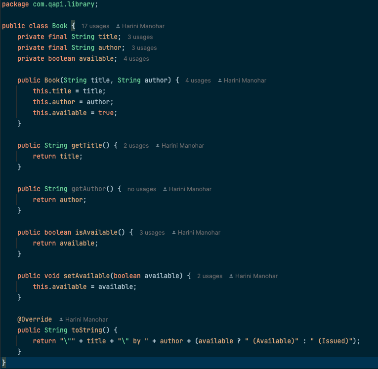
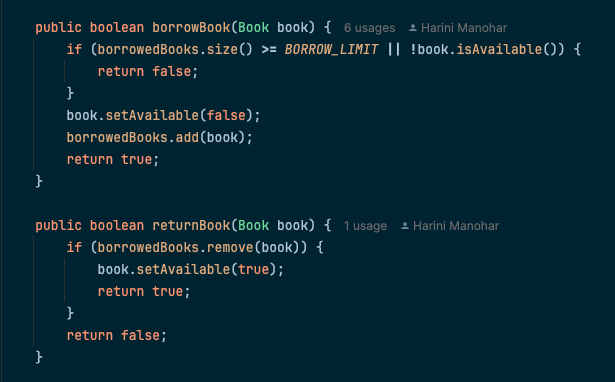
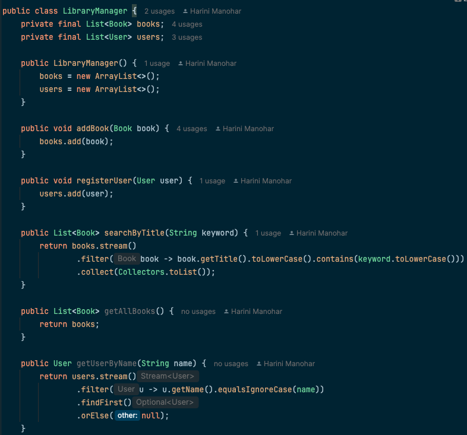
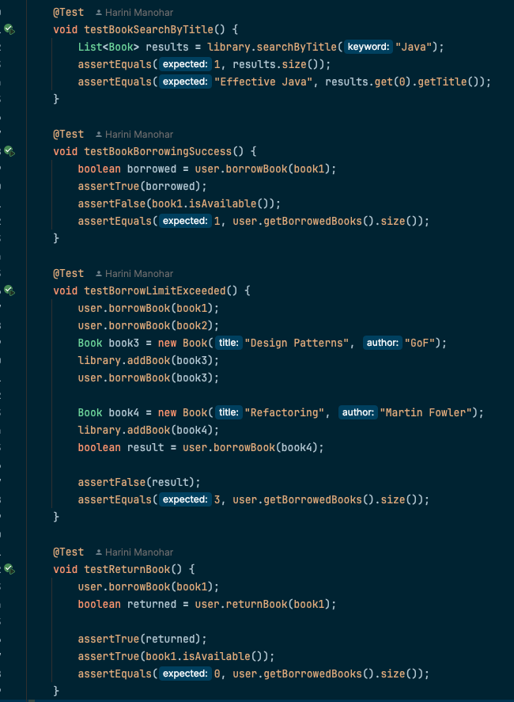
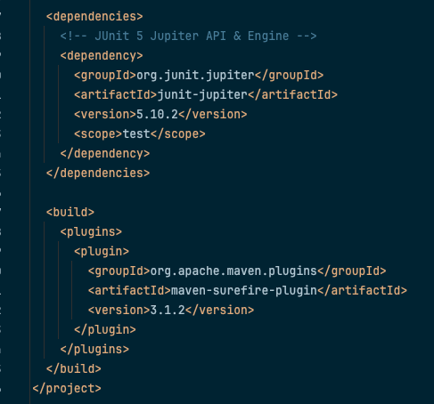

## Library Management System - SDAT & DevOps QAP-1
##### By: Harini Manohar, SD-12, Sem-4 | Date: 29 May, 2025

### 1. Project Overview

This project is a command-line based Library Management System implemented in Java. 
It allows users to register, borrow, return, and search for books. 
The system enforces a maximum borrowing limit and maintains availability status of each book. 
Unit testing is performed using JUnit 5, and CI/CD is handled via GitHub Actions.

---

### 2. Project Structure

<pre>
<code>
LibraryManagementSystem/
├── .github/                                            # GitHub Actions workflows
│   └── workflows/
│       └── maven.yml                                   # CI config to run Maven tests
│
├── screenshots/                                        # Documentation screenshots
│   ├── cleancode1.png                                  # Clean code: meaningful naming
│   ├── cleancode2.png                                  # Clean code: single responsibility
│   ├── cleancode3.png                                  # Clean code: separation of concerns
│   ├── testcases.png                                   # Screenshot of unit test methods
│   └── dependencies.png                                # Screenshot of pom.xml
│
├── src/
│   ├── main/
│   │   └── java/
│   │       └── com/
│   │           └── qap1/
│   │               └── library/
│   │                   ├── Book.java                   # Book entity
│   │                   ├── User.java                   # User logic (borrowing)
│   │                   └── LibraryManager.java         # Core system logic
│
│   └── test/
│       └── java/
│           └── com/
│               └── qap1/
│                   └── library/
│                       └── LibraryManagerTest.java     # JUnit 5 tests
│
├── target/                                             # Maven build output (ignored)
├── .gitignore                                          # Ignore target/, .idea/, etc.
├── pom.xml                                             # Project dependencies (JUnit, Surefire)
└── README.md                                           # Full documentation 
</code>
</pre>

---

### 3. Project Features

- 📖 Book management (add/search/availability)
- 👤 User registration and borrowing
- 🔒 Borrowing limit enforcement (3 books max)
- 🔁 Return book functionality
- 🔍 Search by book title
- 🧪 Unit tested with JUnit 5
- 🔄 Continuous Integration with GitHub Actions

---

### 4. Clean Code Practices

#### 4.1 Meaningful Naming
Variables like title, author, and available in Book.java are clearly named and convey their purpose.

`private String title;`

`private String author;`

`private boolean available;`

#### 4.2 Single Responsibility Principle
The User class contains only borrowing/returning logic, showing good separation of concerns.

`public boolean borrowBook(Book book) { ... }`

`public boolean returnBook(Book book) { ... }`

#### 4.3 Separation of Concerns
LibraryManager.java contains catalog management and user registration logic, separated from UI and entity responsibilities.

`public void addBook(Book book) { ... }`

`public void registerUser(User user) { ... }`

---

### 5. Unit Testing

Unit tests were written using JUnit 5. Both positive and negative test cases are covered:

| Test Case                     | Description                                      | Type      |
|------------------------------|--------------------------------------------------|-----------|
| `testBookSearchByTitle`      | Verifies book can be found by title             | ✅ Positive |
| `testBookBorrowingSuccess`   | Valid borrow if book is available               | ✅ Positive |
| `testBorrowLimitExceeded`    | Blocks user from borrowing > 3 books            | ❌ Negative |
| `testReturnBook`             | Validates returned book is marked available     | ✅ Positive |

📸 **Test case screenshot:**  

---

### 6. Dependencies

The project uses Maven for dependency management.

Key dependencies:
	-	junit-jupiter (5.10.2) for unit testing
	-	maven-surefire-plugin (3.1.2) for test execution
 
Sources: mvnrepository.com, maven.apache.org

---

### 7. GitHub Actions Setup

A GitHub Actions workflow is defined to run on push and pull request to main and dev branches. It:
	•	Sets up JDK 23 (Temurin)
	•	Restores Maven dependency cache
	•	Runs mvn clean verify to build and test

| Feature  | Description            |                       
|----------|------------------------|
| CI Tool  | GitHub Actions         | 
| Trigger  | On push & pull request |
| Java     | Temurin 23             |
| Command  | mvn clean verify       |
 
Status: ✅ Working and visible on PRs

---

### 8. Challenges Faced

-	Git rebase conflict due to remote README
-	Upgrading from JUnit 3 to 5
-	GitHub Actions setup and Maven cache handling
-	Understanding and applying trunk-based workflow with PRs

---

### 9. Author Information

- Name: Harini Manohar
  - SDAT and DevOps – Semester 4
  - Assignment: QAP-1 
